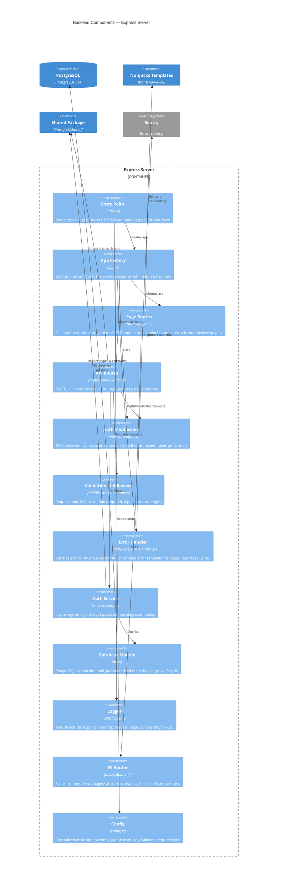

# C4 Level 3: Backend Component Diagram

Shows the internal structure of the Express server container.

## Component Responsibilities

| Component                 | File                                     | Responsibility                                                                                                                   |
| ------------------------- | ---------------------------------------- | -------------------------------------------------------------------------------------------------------------------------------- |
| **Entry Point**           | `backend/src/index.ts`                   | Initializes Sentry, creates the Express app, starts the HTTP server, and handles graceful shutdown (SIGTERM/SIGINT).             |
| **App Factory**           | `backend/src/app.ts`                     | Configures the Express middleware chain: compression, static files, request logging, body parsing, CORS, routes, error handling. |
| **Page Routes**           | `backend/src/routes/pages.ts`            | Uses the file-system router to auto-generate GET routes from `.njk` template files.                                              |
| **API Routes**            | `backend/src/routes/api/v1/index.ts`     | Defines REST endpoints: `POST /auth/login`, `POST /auth/register`, `GET /users/me`.                                              |
| **Auth Middleware**       | `backend/src/middleware/auth.ts`         | Verifies JWT Bearer tokens and attaches `req.user`. Also exports `generateToken()`.                                              |
| **Validation Middleware** | `backend/src/middleware/validation.ts`   | Generic field-level request body validation (required, type, min/max length).                                                    |
| **Error Handler**         | `backend/src/middleware/errorHandler.ts` | Catches all errors. Returns JSON for `/api/` routes, renders error template for page routes. Reports 5xx to Sentry.              |
| **Auth Service**          | `backend/src/services/auth.ts`           | Business logic for login, register, and user lookup. Uses bcrypt for password hashing.                                           |
| **Database Module**       | `backend/src/db.ts`                      | Manages the PostgreSQL connection pool via `pg`. Provides `query()` and `getClient()` helpers.                                   |
| **Logger**                | `backend/src/utils/logger.ts`            | Pino logger instance with pino-http for request logging. Pretty-prints in development.                                           |
| **FS Router**             | `backend/src/utils/fsRouter.ts`          | Scans `frontend/views/pages/` at startup and generates Express routes. Maps `index.njk` to `/`, `about.njk` to `/about`, etc.    |
| **Config**                | `backend/src/config.ts`                  | Loads and validates environment variables. Single source for database URL, JWT secret, port, CORS origin, Sentry DSN, etc.       |

## Middleware Chain (request order)

1. `compression` — gzip responses
2. `express.static` — serve static files from `frontend/public/`
3. `pino-http` — log all requests
4. `express.json` / `express.urlencoded` — parse request bodies
5. `cors` — CORS headers
6. Routes (page routes + API routes)
7. `notFoundHandler` — 404 for unmatched routes
8. `errorHandler` — catch-all error handler
