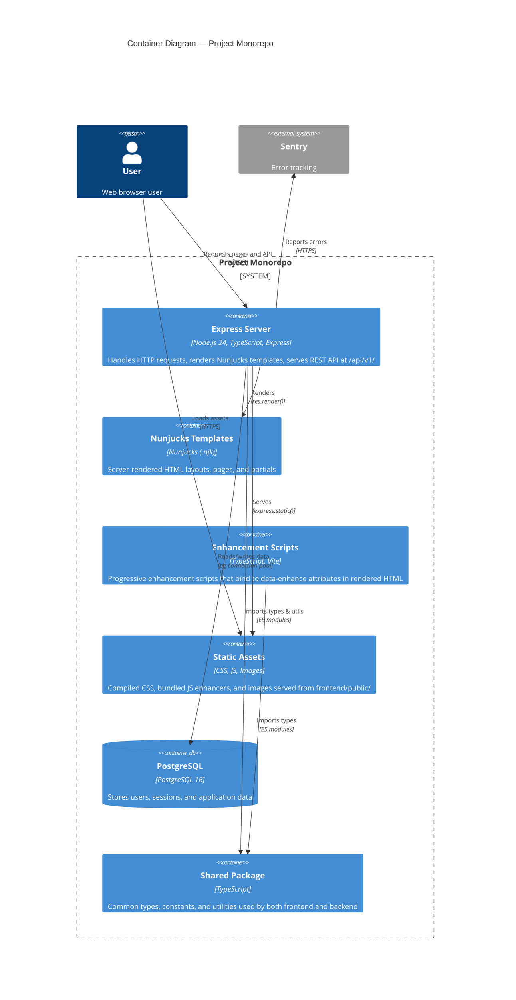

# C4 Level 2: Container Diagram

Shows the high-level technical building blocks of the system.

## Description

| Container               | Technology                      | Purpose                                                                                                                                                                                   |
| ----------------------- | ------------------------------- | ----------------------------------------------------------------------------------------------------------------------------------------------------------------------------------------- |
| **Express Server**      | Node.js 24, TypeScript, Express | Central request handler. Routes page requests to Nunjucks templates and API requests to JSON handlers. Manages middleware chain (auth, validation, logging, compression).                 |
| **Nunjucks Templates**  | Nunjucks                        | Server-side HTML rendering. Templates in `frontend/views/` with layouts, pages, and partials. Rendered by Express via `res.render()`.                                                     |
| **Enhancement Scripts** | TypeScript, Vite                | Client-side progressive enhancement. Built by Vite from `frontend/src/enhancers/` to `frontend/public/js/`. Bind to elements with `data-enhance` attributes.                              |
| **Static Assets**       | CSS, JS, Images                 | Served directly by Express from `frontend/public/`. JS/CSS cached for 1 year, other assets for 1 day. Compression enabled.                                                                |
| **PostgreSQL**          | PostgreSQL 16                   | Relational database. Stores users table. Accessed via `pg` connection pool with parameterized queries.                                                                                    |
| **Shared Package**      | TypeScript                      | `@project/shared` workspace. Provides domain types (`User`), API contract types (`LoginResponse`, `ApiErrorResponse`), constants (`HTTP_STATUS`), and utility functions (`isValidEmail`). |
