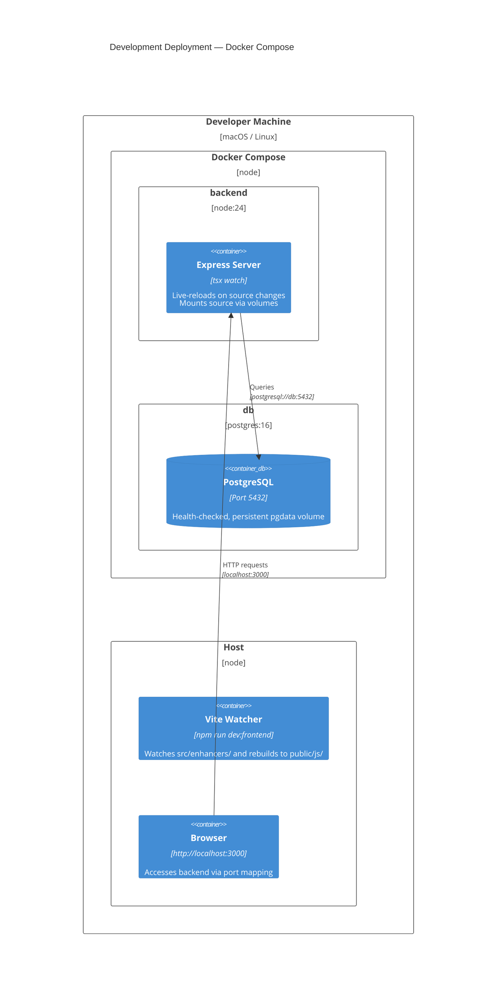
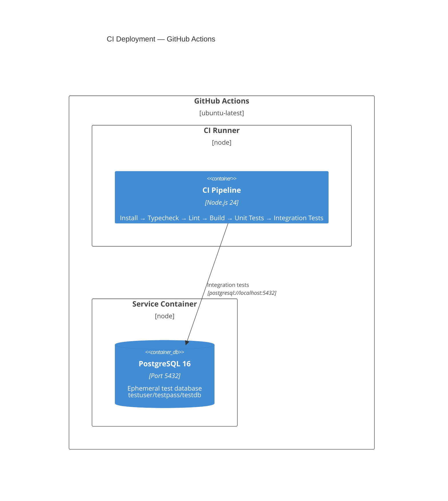

# C4 Deployment Diagram

Shows the infrastructure for development (Docker Compose) and CI (GitHub Actions).

## Development Environment (Docker Compose)

## CI Environment (GitHub Actions)

## Environment Comparison

| Aspect             | Development (Docker)   | CI (GitHub Actions)    | Production    |
| ------------------ | ---------------------- | ---------------------- | ------------- |
| **Node.js**        | 24 (container)         | 24 (.node-version)     | 24            |
| **PostgreSQL**     | 16 (container)         | 16 (service container) | 14+ (managed) |
| **Live Reload**    | tsx watch              | N/A                    | N/A           |
| **Frontend Build** | Vite watch mode (host) | npm run build          | npm run build |
| **Logging**        | Pino pretty            | Pino JSON              | Pino JSON     |
| **Error Tracking** | Optional (Sentry)      | Disabled               | Sentry        |
| **Compression**    | Enabled                | N/A                    | Enabled       |
