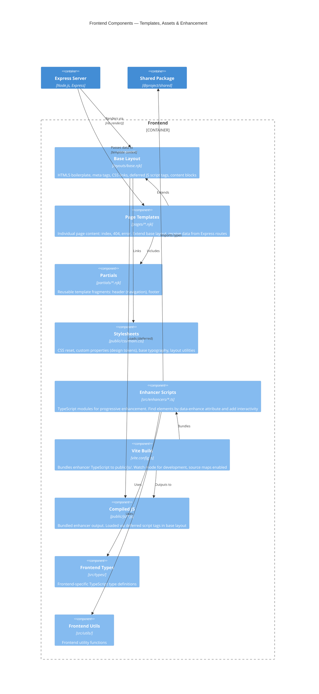

# C4 Level 3: Frontend Component Diagram

Shows the internal structure of the frontend — templates, assets, and the enhancement pipeline.



## Component Responsibilities

| Component            | Path                              | Responsibility                                                                                                                                            |
| -------------------- | --------------------------------- | --------------------------------------------------------------------------------------------------------------------------------------------------------- |
| **Base Layout**      | `frontend/views/layouts/base.njk` | Root HTML structure. Defines `` regions for title, head, content, and scripts. Links to `main.css` and deferred enhancer scripts.              |
| **Page Templates**   | `frontend/views/pages/*.njk`      | Individual pages. Each extends `base.njk` and fills content blocks. Receives typed data from Express route handlers. Auto-registered by the FS router.    |
| **Partials**         | `frontend/views/partials/*.njk`   | Reusable HTML fragments: navigation header, page footer. Included by layouts and pages via ``.                                               |
| **Stylesheets**      | `frontend/public/css/main.css`    | Global styles. CSS custom properties for design tokens, responsive typography, layout grid utilities. No CSS-in-JS or modules.                            |
| **Enhancer Scripts** | `frontend/src/enhancers/*.ts`     | TypeScript source for progressive enhancement. Each enhancer targets elements with `data-enhance="<name>"` attributes and adds client-side interactivity. |
| **Vite Build**       | `frontend/vite.config.ts`         | Build tool. Compiles TypeScript enhancers to `public/js/`. Runs in watch mode during development for fast rebuilds.                                       |
| **Compiled JS**      | `frontend/public/js/*.js`         | Vite build output. Minified JavaScript bundles with source maps. Loaded with `defer` attribute so they execute after DOM is ready.                        |
| **Frontend Types**   | `frontend/src/types/`             | TypeScript types specific to the browser environment.                                                                                                     |
| **Frontend Utils**   | `frontend/src/utils/`             | Helper functions for DOM manipulation and browser APIs.                                                                                                   |

## Progressive Enhancement Flow

```
1. Browser requests page
                ↓
2. Express renders Nunjucks template with server data
                ↓
3. Full HTML page returned (works without JS)
                ↓
4. Browser loads deferred enhancer scripts
                ↓
5. Enhancers find elements with data-enhance="..." attributes
                ↓
6. Enhancers bind event listeners and add interactivity
                ↓
7. Elements get data-enhanced="true" attribute after initialization
```
