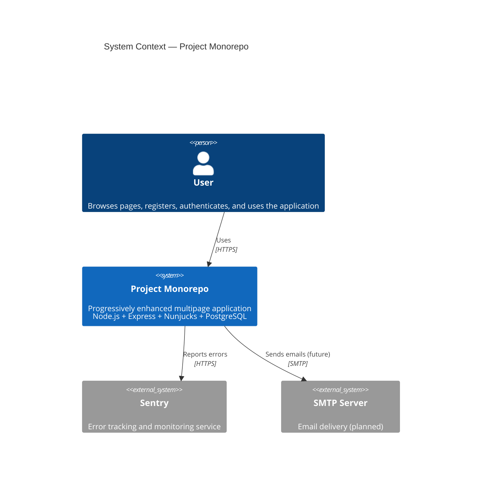

# C4 Level 1: System Context Diagram

Shows how users and external systems interact with the application.

## Description

- **User**: Interacts with the application via a web browser. Pages are server-rendered HTML; JavaScript provides progressive enhancement.
- **Project Monorepo**: The main application system. Serves HTML pages and a RESTful JSON API. Handles authentication via JWT.
- **Sentry**: External error tracking service. The backend reports 5xx errors and unhandled exceptions.
- **SMTP Server**: Planned external dependency for password reset and notification emails.
