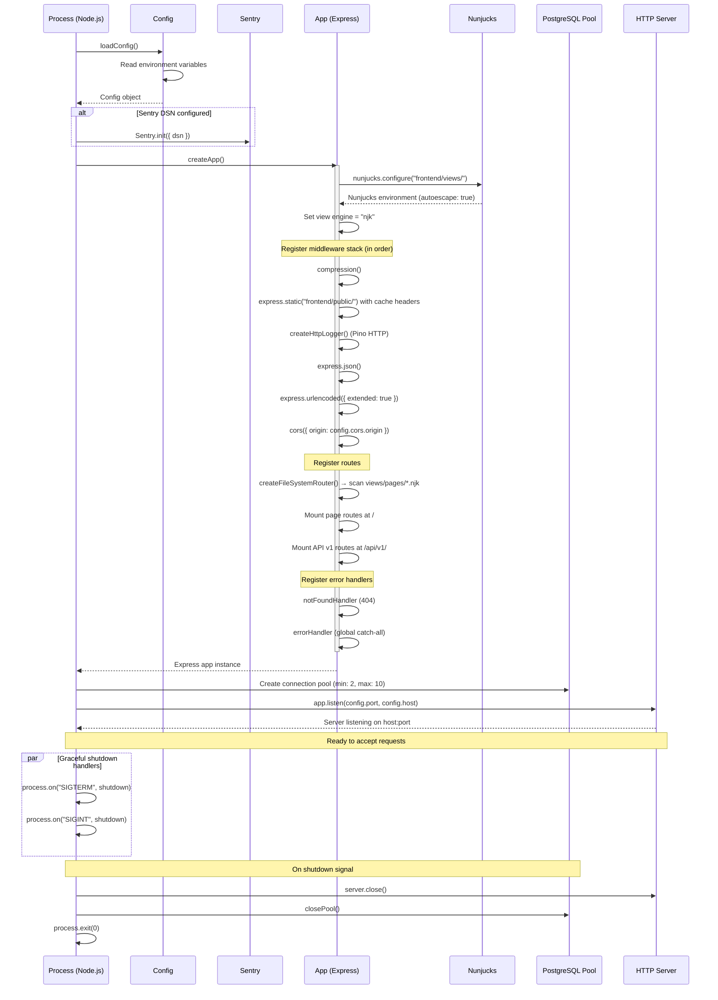

# Sequence Diagram — Application Startup

How the Express server initializes, configures middleware, and begins
accepting requests.

```mermaid
sequenceDiagram
    participant P as Process (Node.js)
    participant C as Config
    participant S as Sentry
    participant A as App (Express)
    participant N as Nunjucks
    participant DB as PostgreSQL Pool
    participant H as HTTP Server

    P->>C: loadConfig()
    C->>C: Read environment variables
    C-->>P: Config object

    alt Sentry DSN configured
        P->>S: Sentry.init({ dsn })
    end

    P->>A: createApp()
    activate A

    A->>N: nunjucks.configure("frontend/views/")
    N-->>A: Nunjucks environment (autoescape: true)
    A->>A: Set view engine = "njk"

    Note over A: Register middleware stack (in order)

    A->>A: compression()
    A->>A: express.static("frontend/public/") with cache headers
    A->>A: createHttpLogger() (Pino HTTP)
    A->>A: express.json()
    A->>A: express.urlencoded({ extended: true })
    A->>A: cors({ origin: config.cors.origin })

    Note over A: Register routes

    A->>A: createFileSystemRouter() → scan views/pages/*.njk
    A->>A: Mount page routes at /
    A->>A: Mount API v1 routes at /api/v1/

    Note over A: Register error handlers

    A->>A: notFoundHandler (404)
    A->>A: errorHandler (global catch-all)

    deactivate A
    A-->>P: Express app instance

    P->>DB: Create connection pool (min: 2, max: 10)
    P->>H: app.listen(config.port, config.host)
    H-->>P: Server listening on host:port

    Note over P,H: Ready to accept requests

    par Graceful shutdown handlers
        P->>P: process.on("SIGTERM", shutdown)
        P->>P: process.on("SIGINT", shutdown)
    end

    Note over P,DB: On shutdown signal
    P->>H: server.close()
    P->>DB: closePool()
    P->>P: process.exit(0)
```
