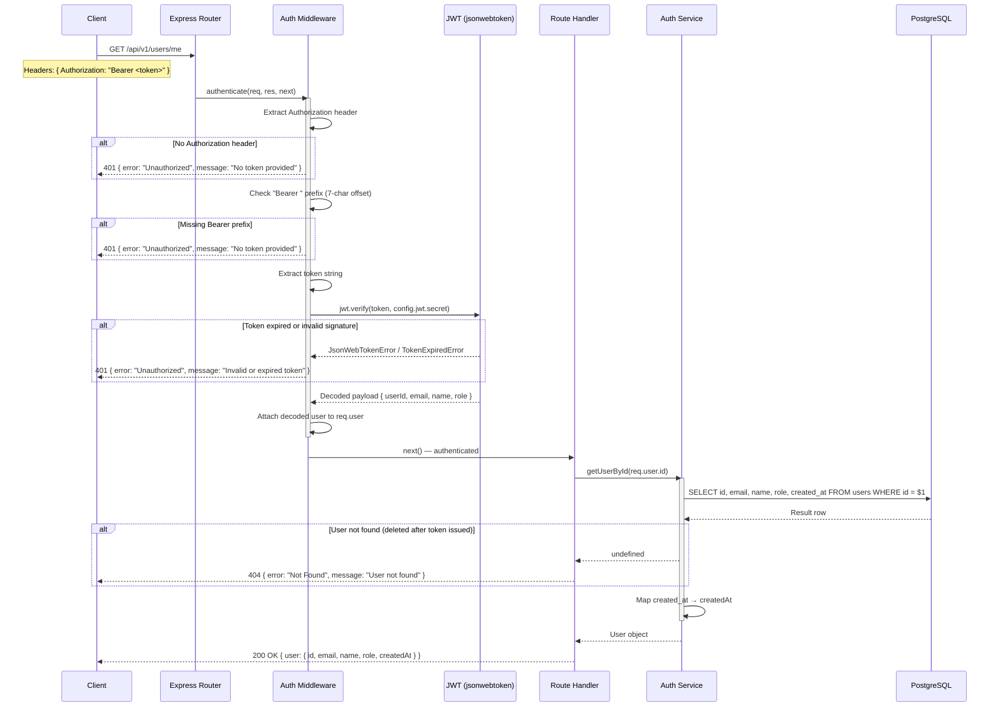

# Sequence Diagram — Authenticated API Request

How a protected endpoint (`GET /api/v1/users/me`) verifies the JWT token,
extracts the user identity, and returns user data from the database.

```mermaid
sequenceDiagram
    participant C as Client
    participant E as Express Router
    participant A as Auth Middleware
    participant JWT as JWT (jsonwebtoken)
    participant R as Route Handler
    participant S as Auth Service
    participant DB as PostgreSQL

    C->>E: GET /api/v1/users/me
    Note over C: Headers: { Authorization: "Bearer <token>" }

    E->>A: authenticate(req, res, next)
    activate A

    A->>A: Extract Authorization header
    alt No Authorization header
        A-->>C: 401 { error: "Unauthorized", message: "No token provided" }
    end

    A->>A: Check "Bearer " prefix (7-char offset)
    alt Missing Bearer prefix
        A-->>C: 401 { error: "Unauthorized", message: "No token provided" }
    end

    A->>A: Extract token string

    A->>JWT: jwt.verify(token, config.jwt.secret)
    alt Token expired or invalid signature
        JWT-->>A: JsonWebTokenError / TokenExpiredError
        A-->>C: 401 { error: "Unauthorized", message: "Invalid or expired token" }
    end
    JWT-->>A: Decoded payload { userId, email, name, role }

    A->>A: Attach decoded user to req.user
    deactivate A
    A->>R: next() — authenticated

    R->>S: getUserById(req.user.id)
    activate S

    S->>DB: SELECT id, email, name, role, created_at FROM users WHERE id = $1
    DB-->>S: Result row

    alt User not found (deleted after token issued)
        S-->>R: undefined
        R-->>C: 404 { error: "Not Found", message: "User not found" }
    end

    S->>S: Map created_at → createdAt
    deactivate S
    S-->>R: User object

    R-->>C: 200 OK { user: { id, email, name, role, createdAt } }
```
