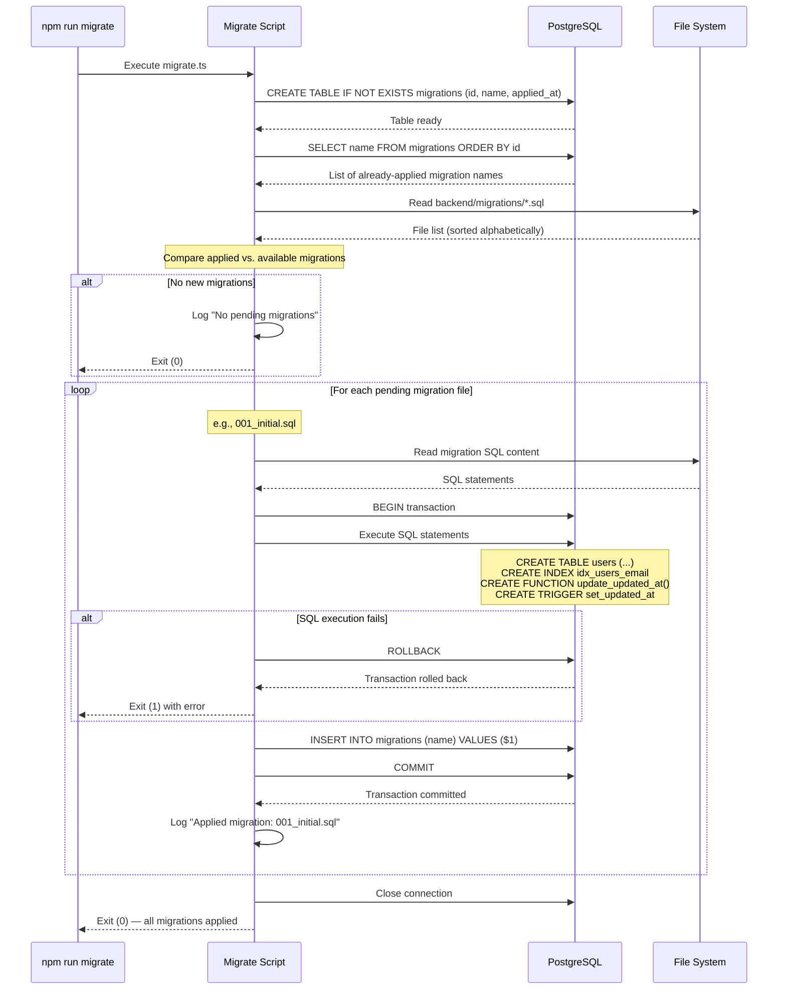

# Sequence Diagram — Database Migration

How the migration runner discovers, orders, and applies SQL migration files
to the PostgreSQL database.

```mermaid
sequenceDiagram
    participant CLI as npm run migrate
    participant M as Migrate Script
    participant DB as PostgreSQL
    participant FS as File System

    CLI->>M: Execute migrate.ts

    M->>DB: CREATE TABLE IF NOT EXISTS migrations (id, name, applied_at)
    DB-->>M: Table ready

    M->>DB: SELECT name FROM migrations ORDER BY id
    DB-->>M: List of already-applied migration names

    M->>FS: Read backend/migrations/*.sql
    FS-->>M: File list (sorted alphabetically)

    Note over M: Compare applied vs. available migrations

    alt No new migrations
        M->>M: Log "No pending migrations"
        M-->>CLI: Exit (0)
    end

    loop For each pending migration file
        Note over M: e.g., 001_initial.sql

        M->>FS: Read migration SQL content
        FS-->>M: SQL statements

        M->>DB: BEGIN transaction

        M->>DB: Execute SQL statements
        Note over DB: CREATE TABLE users (...)<br/>CREATE INDEX idx_users_email<br/>CREATE FUNCTION update_updated_at()<br/>CREATE TRIGGER set_updated_at

        alt SQL execution fails
            M->>DB: ROLLBACK
            DB-->>M: Transaction rolled back
            M-->>CLI: Exit (1) with error
        end

        M->>DB: INSERT INTO migrations (name) VALUES ($1)
        M->>DB: COMMIT
        DB-->>M: Transaction committed

        M->>M: Log "Applied migration: 001_initial.sql"
    end

    M->>DB: Close connection
    M-->>CLI: Exit (0) — all migrations applied
```
