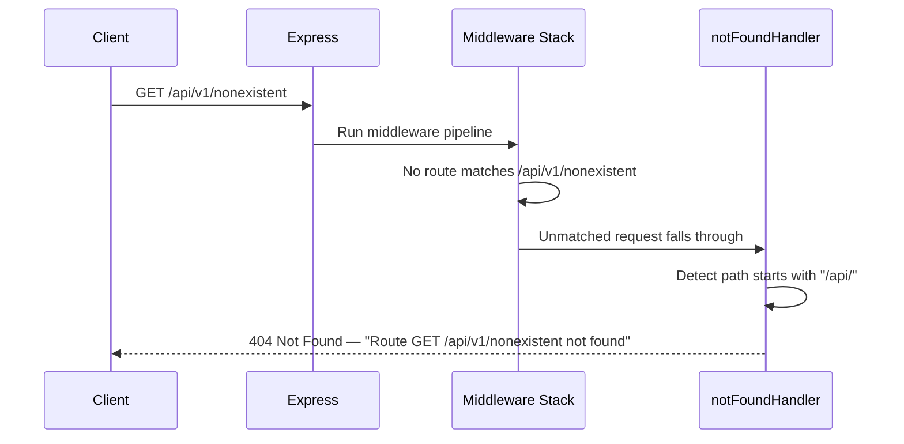
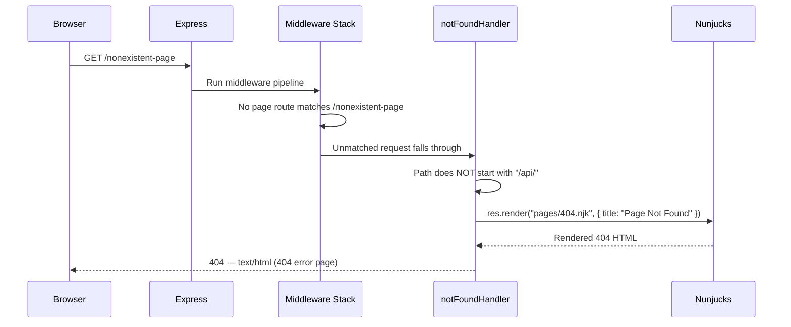
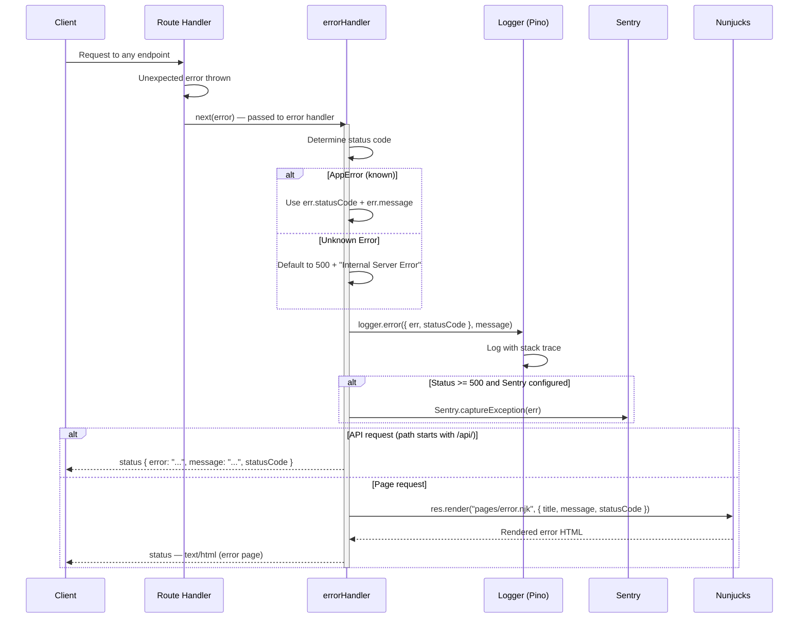

# Sequence Diagram — Error Handling

How errors propagate through the middleware stack for validation errors,
not-found routes, and unexpected server errors.

## Validation Error (422)

```mermaid
sequenceDiagram
    participant C as Client
    participant E as Express Router
    participant V as Validation Middleware

    C->>E: POST /api/v1/auth/login
    Note over C: Body: { email: "" } — missing password

    E->>V: validate(rules)
    activate V

    V->>V: Check email — required → empty string fails
    V->>V: Accumulate error: email is required
    V->>V: Check password — required → undefined fails
    V->>V: Accumulate error: password is required

    V->>V: errors.length > 0

    deactivate V
    V-->>C: 422 Validation Error — "email is required; password is required"
```

## Not Found — API Route (404 JSON)



## Not Found — Page Route (404 HTML)



## Unexpected Server Error (500)


