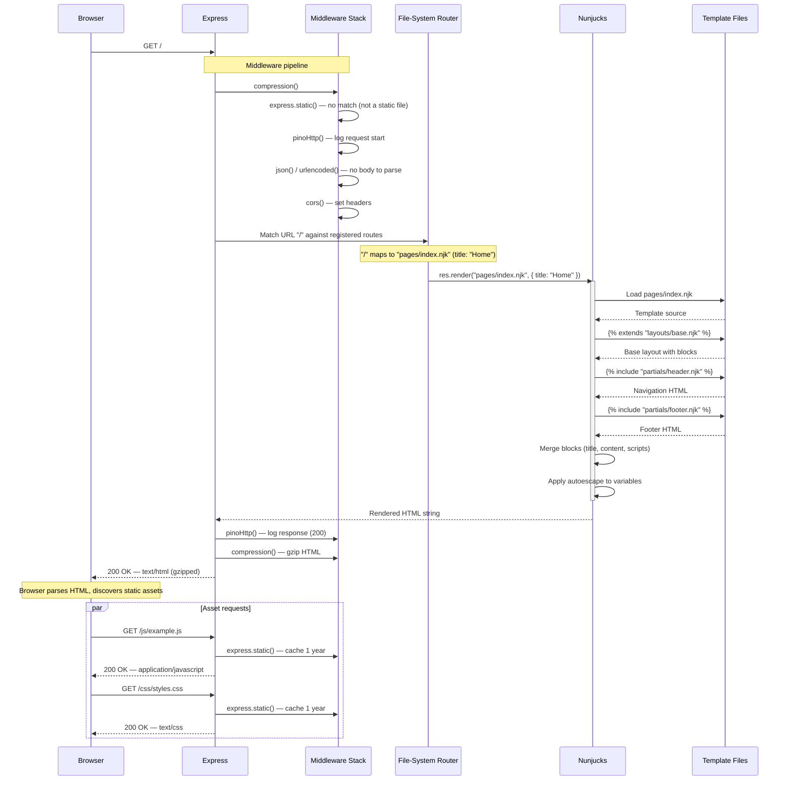

# Sequence Diagram — Page Request (File-System Routing)

How a browser request for a page (e.g. `GET /`) is resolved through the
file-system router, rendered by Nunjucks, and returned as HTML.

```mermaid
sequenceDiagram
    participant B as Browser
    participant E as Express
    participant MW as Middleware Stack
    participant FSR as File-System Router
    participant NJ as Nunjucks
    participant T as Template Files

    B->>E: GET /

    Note over E,MW: Middleware pipeline

    E->>MW: compression()
    MW->>MW: express.static() — no match (not a static file)
    MW->>MW: pinoHttp() — log request start
    MW->>MW: json() / urlencoded() — no body to parse
    MW->>MW: cors() — set headers

    E->>FSR: Match URL "/" against registered routes
    Note over FSR: "/" maps to "pages/index.njk" (title: "Home")

    FSR->>NJ: res.render("pages/index.njk", { title: "Home" })
    activate NJ

    NJ->>T: Load pages/index.njk
    T-->>NJ: Template source

    NJ->>T: {% extends "layouts/base.njk" %}
    T-->>NJ: Base layout with blocks

    NJ->>T: {% include "partials/header.njk" %}
    T-->>NJ: Navigation HTML

    NJ->>T: {% include "partials/footer.njk" %}
    T-->>NJ: Footer HTML

    NJ->>NJ: Merge blocks (title, content, scripts)
    NJ->>NJ: Apply autoescape to variables
    deactivate NJ

    NJ-->>E: Rendered HTML string

    E->>MW: pinoHttp() — log response (200)
    E->>MW: compression() — gzip HTML
    E-->>B: 200 OK — text/html (gzipped)

    Note over B: Browser parses HTML, discovers static assets

    par Asset requests
        B->>E: GET /js/example.js
        E->>MW: express.static() — cache 1 year
        E-->>B: 200 OK — application/javascript

        B->>E: GET /css/styles.css
        E->>MW: express.static() — cache 1 year
        E-->>B: 200 OK — text/css
    end
```
