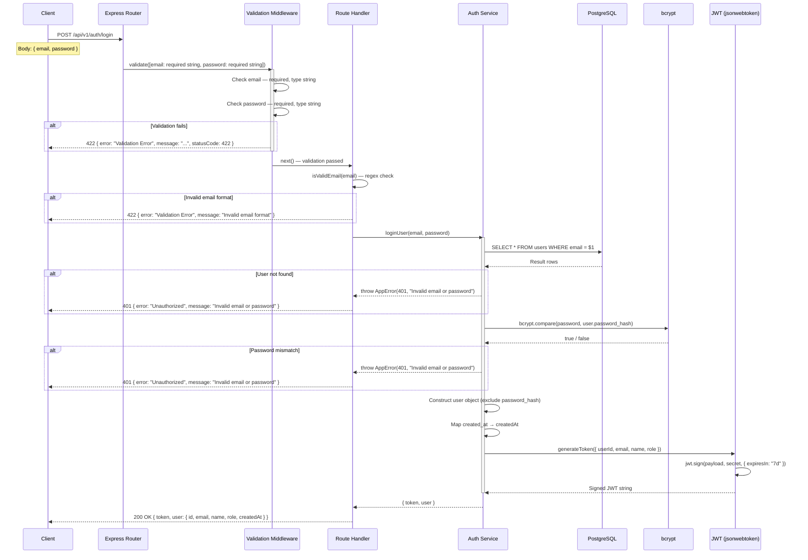

# Sequence Diagram — User Login

Full flow for `POST /api/v1/auth/login` including validation, credential
verification with bcrypt, and JWT token generation.

```mermaid
sequenceDiagram
    participant C as Client
    participant E as Express Router
    participant V as Validation Middleware
    participant R as Route Handler
    participant S as Auth Service
    participant DB as PostgreSQL
    participant BC as bcrypt
    participant JWT as JWT (jsonwebtoken)

    C->>E: POST /api/v1/auth/login
    Note over C: Body: { email, password }

    E->>V: validate([email: required string, password: required string])
    activate V

    V->>V: Check email — required, type string
    V->>V: Check password — required, type string

    alt Validation fails
        V-->>C: 422 { error: "Validation Error", message: "...", statusCode: 422 }
    end

    deactivate V
    V->>R: next() — validation passed

    R->>R: isValidEmail(email) — regex check
    alt Invalid email format
        R-->>C: 422 { error: "Validation Error", message: "Invalid email format" }
    end

    R->>S: loginUser(email, password)
    activate S

    S->>DB: SELECT * FROM users WHERE email = $1
    DB-->>S: Result rows

    alt User not found
        S-->>R: throw AppError(401, "Invalid email or password")
        R-->>C: 401 { error: "Unauthorized", message: "Invalid email or password" }
    end

    S->>BC: bcrypt.compare(password, user.password_hash)
    BC-->>S: true / false

    alt Password mismatch
        S-->>R: throw AppError(401, "Invalid email or password")
        R-->>C: 401 { error: "Unauthorized", message: "Invalid email or password" }
    end

    S->>S: Construct user object (exclude password_hash)
    S->>S: Map created_at → createdAt

    S->>JWT: generateToken({ userId, email, name, role })
    JWT->>JWT: jwt.sign(payload, secret, { expiresIn: "7d" })
    JWT-->>S: Signed JWT string

    deactivate S
    S-->>R: { token, user }

    R-->>C: 200 OK { token, user: { id, email, name, role, createdAt } }
```
