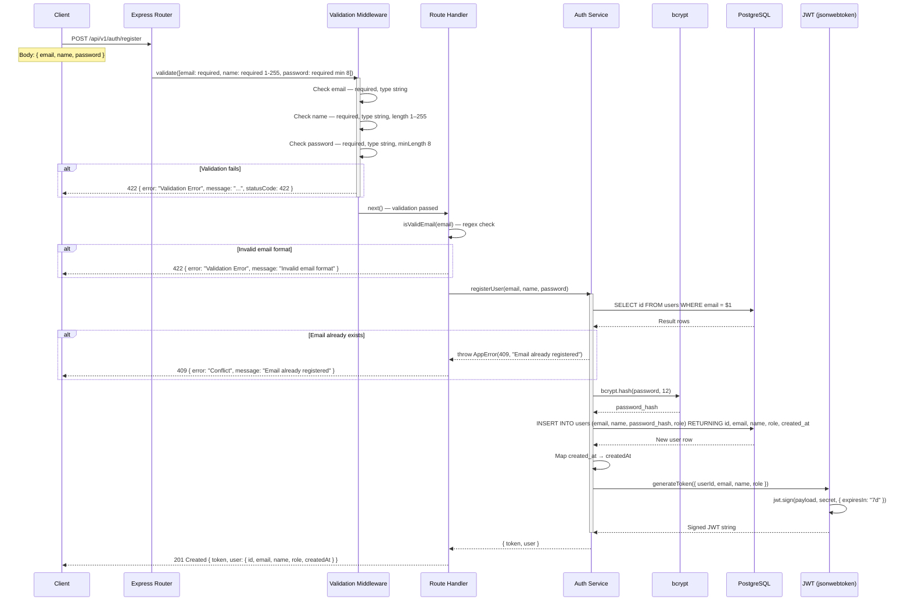

# Sequence Diagram — User Registration

Full flow for `POST /api/v1/auth/register` from request validation through
database insertion and JWT generation.

```mermaid
sequenceDiagram
    participant C as Client
    participant E as Express Router
    participant V as Validation Middleware
    participant R as Route Handler
    participant S as Auth Service
    participant BC as bcrypt
    participant DB as PostgreSQL
    participant JWT as JWT (jsonwebtoken)

    C->>E: POST /api/v1/auth/register
    Note over C: Body: { email, name, password }

    E->>V: validate([email: required, name: required 1-255, password: required min 8])
    activate V

    V->>V: Check email — required, type string
    V->>V: Check name — required, type string, length 1–255
    V->>V: Check password — required, type string, minLength 8

    alt Validation fails
        V-->>C: 422 { error: "Validation Error", message: "...", statusCode: 422 }
    end

    deactivate V
    V->>R: next() — validation passed

    R->>R: isValidEmail(email) — regex check
    alt Invalid email format
        R-->>C: 422 { error: "Validation Error", message: "Invalid email format" }
    end

    R->>S: registerUser(email, name, password)
    activate S

    S->>DB: SELECT id FROM users WHERE email = $1
    DB-->>S: Result rows

    alt Email already exists
        S-->>R: throw AppError(409, "Email already registered")
        R-->>C: 409 { error: "Conflict", message: "Email already registered" }
    end

    S->>BC: bcrypt.hash(password, 12)
    BC-->>S: password_hash

    S->>DB: INSERT INTO users (email, name, password_hash, role) RETURNING id, email, name, role, created_at
    DB-->>S: New user row

    S->>S: Map created_at → createdAt

    S->>JWT: generateToken({ userId, email, name, role })
    JWT->>JWT: jwt.sign(payload, secret, { expiresIn: "7d" })
    JWT-->>S: Signed JWT string

    deactivate S
    S-->>R: { token, user }

    R-->>C: 201 Created { token, user: { id, email, name, role, createdAt } }
```
